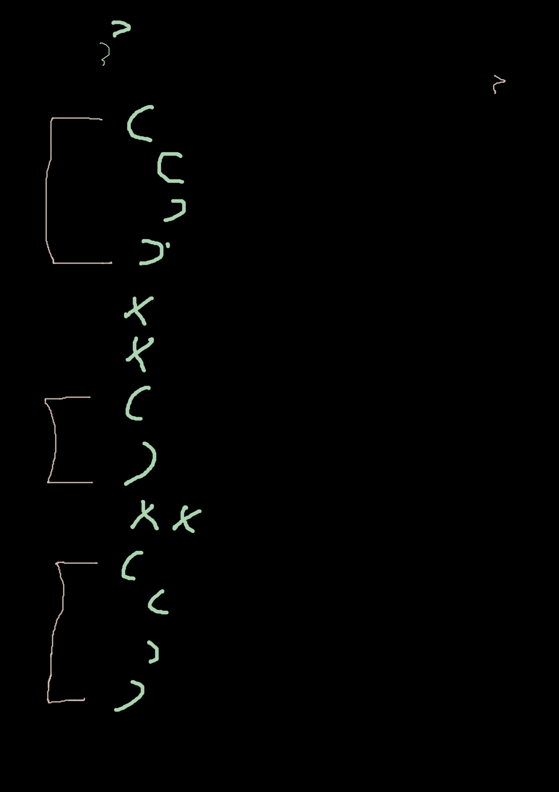

# haskell-extract-code-block
## Extract all code blocks from a list of strings

# Definition of code block
## code block example 1
``` haskell
   ( UnGuardedRhs
   )
```

## code block example 2
``` haskell
   ( UnGuardedRhs
     (
	 )
   )
```
## code block example 3
``` haskell
   ( UnGuardedRhs
     (
	  []
	  xx
	 )
   )
```
# Input

``` haskell
[ "           line 1"
, "         ( UnGuardedRhs"
, "  )"
, "  xx"
, " ( UnGuardedRhs"
, "  ("
, "  ("
, "  )"
, "  )"
, " )"
, " xx"
, " ( UnGuardedRhs"
, " ( KK"
, "  )"
, " )"
]
```
# Output
``` haskell
[
    [ "\x9 ( UnGuardedRhs"
    , "\x9 ( KK"
    , "\x9  )"
    , "\x9 )"
    ]
,
    [ "\x9 ( UnGuardedRhs"
    , "\x9  ("
    , "\x9  ("
    , "\x9  )"
    , "\x9  )"
    , "\x9 )"
    ]
,
    [ "         ( UnGuardedRhs"
    , "\x9  )"
    ]
]
```

* Function DOES NOT depent on other function in Haskell

``` haskell
	fun3::Int -> Int
	fun3 x = x + 1
```

* Function Implementation in Haskell with **FunBind**

``` haskell
    , FunBind
        ( SrcSpanInfo
            { srcInfoSpan = SrcSpan "/Users/aaa/myfile/bitbucket/testfile/Main.hs" 12 1 12 13
            , srcInfoPoints = []
            }
        )
        [ Match
            ( SrcSpanInfo
                { srcInfoSpan = SrcSpan "/Users/aaa/myfile/bitbucket/testfile/Main.hs" 12 1 12 13
                , srcInfoPoints = []
                }
            )
            ( Ident
                ( SrcSpanInfo
                    { srcInfoSpan = SrcSpan "/Users/aaa/myfile/bitbucket/testfile/Main.hs" 12 1 12 5
                    , srcInfoPoints = []
                    }
                ) "fun3"
           )
            [ PVar
               ( SrcSpanInfo
                    { srcInfoSpan = SrcSpan "/Users/aaa/myfile/bitbucket/testfile/Main.hs" 12 6 12 7
                    , srcInfoPoints = []
                    }
                )
                ( Ident
                    ( SrcSpanInfo
                        { srcInfoSpan = SrcSpan "/Users/aaa/myfile/bitbucket/testfile/Main.hs" 12 6 12 7
                        , srcInfoPoints = []
                        }
                    ) "x"
                )
            , PVar
                ( SrcSpanInfo
                    { srcInfoSpan = SrcSpan "/Users/aaa/myfile/bitbucket/testfile/Main.hs" 12 8 12 9
                    , srcInfoPoints = []
                    }
                )
                ( Ident
                    ( SrcSpanInfo
                        { srcInfoSpan = SrcSpan "/Users/aaa/myfile/bitbucket/testfile/Main.hs" 12 8 12 9
                        , srcInfoPoints = []
                        }
                    ) "y"
                )
            ]
            ( UnGuardedRhs
                ( SrcSpanInfo
                    { srcInfoSpan = SrcSpan "/Users/aaa/myfile/bitbucket/testfile/Main.hs" 12 10 12 13
                    , srcInfoPoints =
                        [ SrcSpan "/Users/aaa/myfile/bitbucket/testfile/Main.hs" 12 10 12 11 ]
                    }
                )
                ( Lit
                    ( SrcSpanInfo
                        { srcInfoSpan = SrcSpan "/Users/aaa/myfile/bitbucket/testfile/Main.hs" 12 12 12 13
                        , srcInfoPoints = []
                        }
                    )
                    ( Int
                        ( SrcSpanInfo
                            { srcInfoSpan = SrcSpan "/Users/aaa/myfile/bitbucket/testfile/Main.hs" 12 12 12 13
                            , srcInfoPoints = []
                            }
                        ) 3 "3"
                    )
                )
            ) Nothing
        ]
```

* Function Signature using **TypeSig** in Haskell

``` haskell
    , TypeSig
        ( SrcSpanInfo
            { srcInfoSpan = SrcSpan "/Users/aaa/myfile/bitbucket/testfile/Main.hs" 8 1 8 25
            , srcInfoPoints =
                [ SrcSpan "/Users/aaa/myfile/bitbucket/testfile/Main.hs" 8 5 8 7 ]
            }
        )
        [ Ident
            ( SrcSpanInfo
                { srcInfoSpan = SrcSpan "/Users/aaa/myfile/bitbucket/testfile/Main.hs" 8 1 8 5
                , srcInfoPoints = []
                }
            ) "fun2"
        ]
		...
		types
		...
```

* Function depents on other function in Haskell

``` haskell
   fun::Int -> Int 
   fun x = fun2 x
   
   fun2::Int -> Int
   fun2 x = x + 2
```



